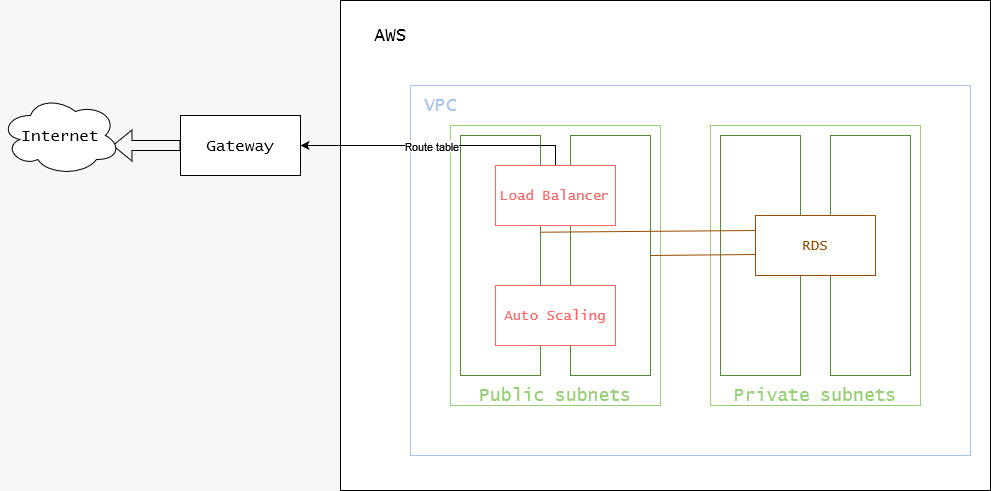

# Projeto Computação em Nuvem 2023/2

* Pedro Bittar Barão

## Introdução

Nosso objetivo é provisionar uma arquitetura na AWS, utilizando o Terraform, que englobe o uso de um Application Load Balancer (ALB), instâncias EC2 com Auto Scaling e um banco de dados RDS.

## Procedimento Terraform

É necessário ter uma conta na AWS e obter seu access_key_id e secret_access_key. Em sequência, instalar a AWS CLI e configurar as credênciais. Por fim, deve-se instalar o Terraform.

Após isso, é necessário configurar o arquivo terraform.tfvars em *./terraform* com as informações necessárias para a criação do banco de dados RDS:

```python
db_username = "<usuário>"
db_password = "<senha>"
```

Antes de prosseguir, devem ser criados um bucket S3 e uma tabela Dynamodb, com o campo *chave de partição* preenchido com *LockID*, pelo console da AWS

Em seguida, devem ser executados os seguintes comandos dentro da pasta raíz do projeto:

```bash
terraform init
terraform validate
terraform plan -out="tfplan"
terraform apply "tfplan"
```

Para acessar a interface da API, deve-se inserir no browser a endpoint do loadbalancer, que pode ser encontrada no console da AWS, seguido de */docs*

Após a utilização, pode-se destruir a infraestrutura com:

```bash
terraform destroy
```

## Diagrama



## Decisões de projeto

* Aplicação: Elastic Compute Cloud (EC2)
* Banco de Dados Relational: Database Service (RDS)
* Balanceamento de carga:  Application Load Balancer (ALB)
* Comunicação entre serviços: Virtual Private Cloud (VPC)
* Monitoramento de uso: CloudWatch
* Proteção da comunicação: Security Groups
* Redirecionamento para instância saudáveis: Health Checks para o ALB
* Alta disponibilidade:  Auto Scaling Group (ASG)
* Segurança das instâncias: IAM Role

### Região

A região escolhida foi us-east-1, que corresponde à região do Norte da Virgínia, nos EUA. Ela possui menores custos por instâncias e por transferências de dados, menores latências e atendem a todos os requesitos de serviços necessários para esse projeto.

[Fonte](https://www.concurrencylabs.com/blog/choose-your-aws-region-wisely/)

## Custos

O cálculo de custos pode ser encontrado no arquivo *My Estimate - AWS Pricing Calculator.pdf*, na pasta raíz do projeto, ou [aqui](https://calculator.aws/#/estimate?id=67b896516deeea88e018a7cd888800849848b4fb)